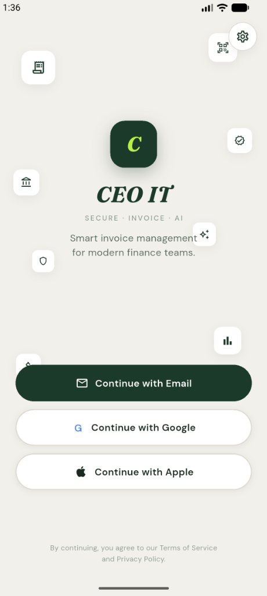
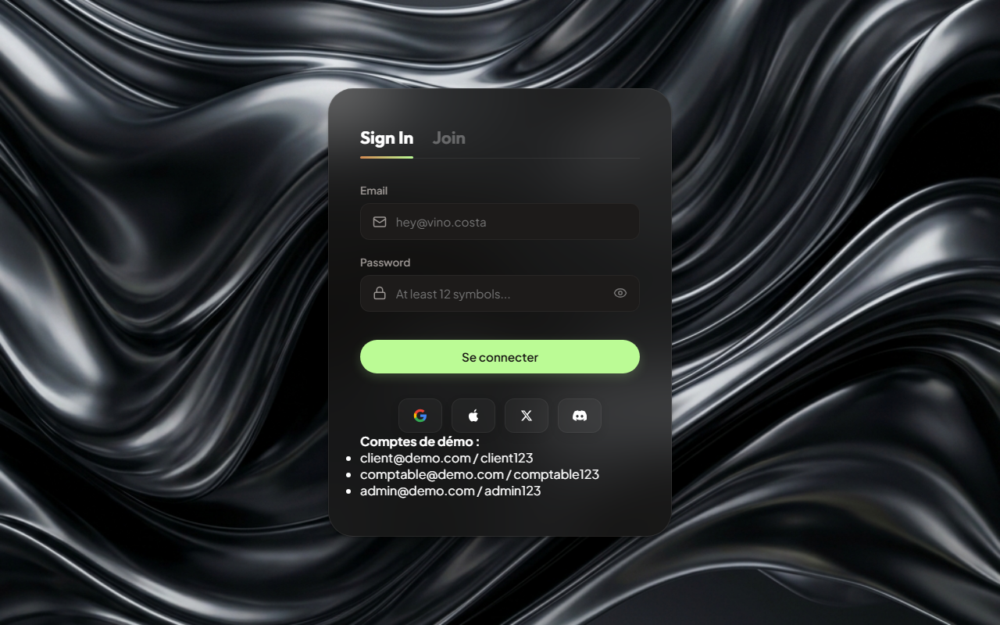
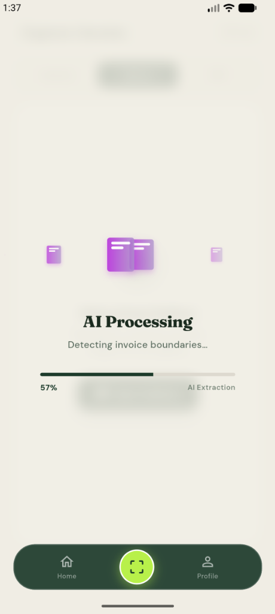
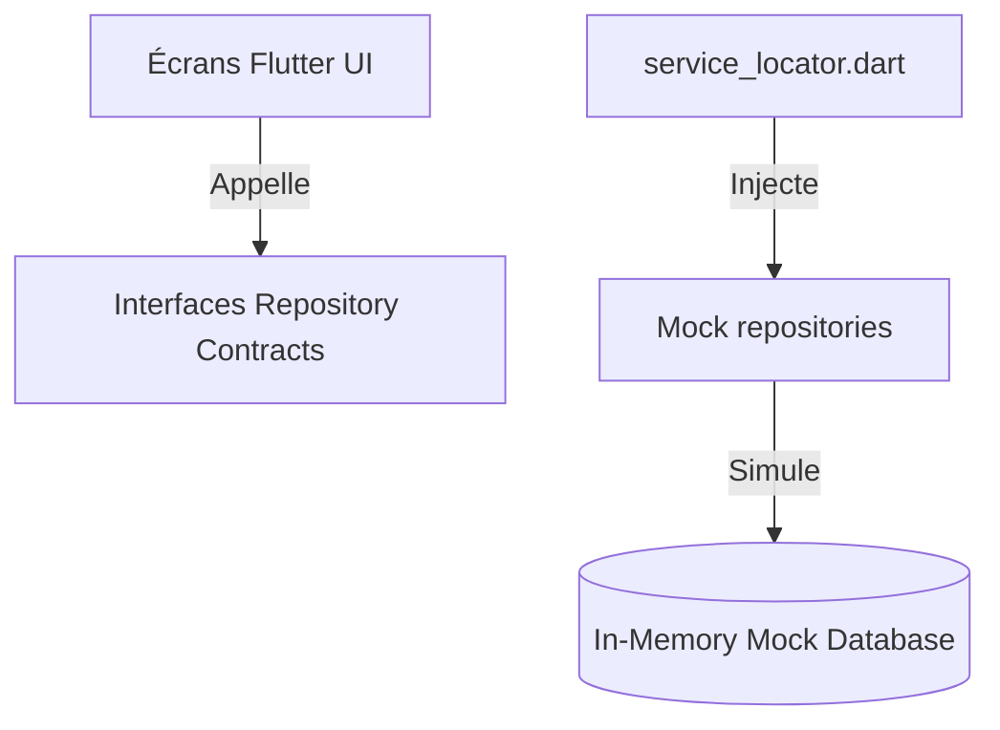

# CEO-IT Mobile Client - Standalone Offline Prototype 🚀
**Auteur & Développeur Full-Stack : Yassine Atrous**

Bienvenue dans le dépôt officiel de l'application mobile **CEO-IT**, une solution mobile autonome, intelligente et sécurisée de capture et de suivi de factures (OCR, conformité réglementaire et détection de fraude).

Ce projet a été conçu selon des principes de développement professionnels afin de proposer un **prototype standalone haut de gamme** (Mock Sandbox) fonctionnant de manière autonome et sécurisée, sans dépendance réseau externe.

---

## 📸 Aperçu de l'Application (Thème Cream & Forest Green)

| Écran de Connexion | Tableau de Bord | Capture OCR & Scan | Animation IA / Chargement |
| :---: | :---: | :---: | :---: |
|  |  |  |  |

### 🎥 Démo Vidéo en Action (Walkthrough)

Découvrez le scénario de navigation complet et l'animation personnalisée de traitement de fichiers en action :

<video src="screenshots/demo.mp4" width="320" height="640" controls></video>

---

## 🌟 Fonctionnalités Standalone & Simulateur IA (Offline Sandbox)

L'application intègre des moteurs de simulation en mémoire qui reproduisent fidèlement le fonctionnement du serveur :
*   **Authentification Multi-Rôles (RBAC)** : Boutons d'accès rapide simulant la connexion pour chaque rôle :
    *   `client@demo.com` : Espace client (dépôt photo/PDF, liste restreinte).
    *   `comptable@demo.com` : Espace collaborateur (contrôle de conformité, validation/rejet de factures, ajout de commentaires de révision).
    *   `admin@demo.com` : Vue globale d'administration et configuration.
*   **Tableau de Bord Dynamique (KPIs Réels)** : Les montants de trésorerie (Inflow/Outflow/Pending) et le nombre de factures sont **calculés dynamiquement en temps réel** à partir de la base de données locale en mémoire. Aucun chiffre n'est codé en dur !
*   **Simulateur OCR & IA (2.0 secondes de traitement)** : Lors de la capture d'une photo ou d'un PDF, l'application simule le temps de traitement de l'API Gemini et extrait dynamiquement les métadonnées (Fournisseur, Numéro, IBAN, Montants) avec tracé des zones de délimitation (bounding boxes).
*   **Moteur de Conformité & Risque** : Détecte les erreurs financières en local (par exemple, un écart de TVA comme sur la facture *Best Trade* ou un IBAN suspect sur *Alpha Industrie*) et calcule le score de fraude explicable associé.

---

## 📘 Architecture Pro : Inversion de Dépendance & Service Locator

Pour prouver la flexibilité du code face au jury, l'application est structurée selon les meilleurs standards de la **Clean Architecture** :



*   **Repository Pattern (Contrats)** : [auth_repository.dart](file:///c:/plateforme/mobile/lib/repositories/auth_repository.dart) et [invoice_repository.dart](file:///c:/plateforme/mobile/lib/repositories/invoice_repository.dart) définissent les fonctions abstraites requises par l'application mobile.
*   **Service Locator (DI)** : [service_locator.dart](file:///c:/plateforme/mobile/lib/core/service_locator.dart) injecte les dépôts de mock hors-ligne (`MockAuthRepository` et `MockInvoiceRepository`).
*   *Avantage pour la soutenance* : Pour connecter l'application à un vrai serveur de production, il suffit de changer deux lignes de code dans le `ServiceLocator` pour brancher les dépôts HTTP (`HttpAuthRepository` et `HttpInvoiceRepository`). Le code des écrans graphiques reste inchangé.

---

## 🛠️ Guide de Lancement (Pour le Jury)

### Étape 1 : Prérequis
1.  Installez le SDK **Flutter** sur votre poste de travail.
2.  Assurez-vous de disposer d'un émulateur Android (ou iOS sur macOS) opérationnel.

### Étape 2 : Démarrage de l'application
Ouvrez votre terminal dans le dossier `mobile/` et exécutez les commandes suivantes :
```bash
flutter pub get
flutter run
```

### Étape 3 : Scénario de Démonstration (Soutenance)
1.  **Connexion** : Cliquez sur le bouton rapide **Comptable** sur l'écran d'accueil pour vous connecter instantanément.
2.  **Dashboard** : Présentez le graphique dynamique et les KPIs. Expliquez que ces indicateurs se mettent à jour automatiquement à chaque modification.
3.  **Vérification de Conformité** : Cliquez sur la facture de *Best Trade* (statut en attente). Montrez l'erreur de calcul de TVA signalée en rouge par le moteur de conformité local.
4.  **Détection de Fraude** : Cliquez sur la facture de *Alpha Industrie*. Présentez le score de risque critique (85%) déclenché par l'anomalie d'IBAN (substitution de coordonnées bancaires détectée).
5.  **Validation Métier** : Modifiez le statut d'une facture en "Validée" ou "Rejetée", saisissez un commentaire de révision comptable et sauvegardez. Constatez la mise à jour immédiate du tableau de bord.
6.  **Simulation OCR** : Cliquez sur le bouton central de Capture, sélectionnez une image ou un PDF de facture, et validez. Assistez à l'analyse asynchrone de 2 secondes simulant le traitement IA, puis vérifiez les données pré-remplies dans le formulaire.

---

## 🧪 Tests Unitaires et de Rendu
L'ensemble de la logique de rendu et de navigation fait l'objet de tests automatisés. Vous pouvez exécuter la suite de tests avec :
```bash
flutter test
```

---

**Développé avec passion par Yassine Atrous.** 🚀  
*Conçu selon les standards d'ingénierie logicielle pour un rendu robuste, fluide et impressionnant.*
