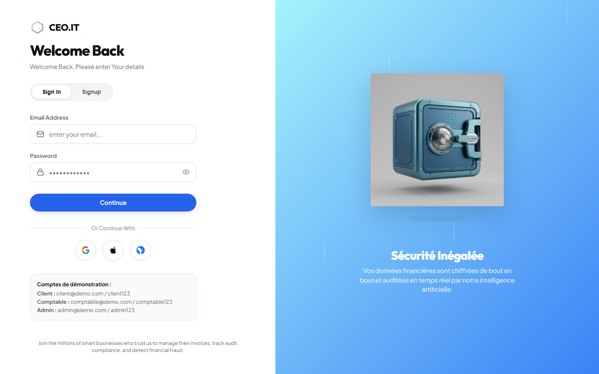

# SecureInvoice AI - Mobile Client 🚀

[](https://github.com/yassinelaatrous/secure-invoice-ai/actions)
[](LICENSE)

Bienvenue dans **SecureInvoice AI Mobile**, l'application cliente mobile ultime de gestion de factures alimentée par l'Intelligence Artificielle. Ce projet a été repensé pour offrir une expérience utilisateur exceptionnelle utilisant un design moderne blanc et vert lime (Light Theme), inspiré de l'esthétique épurée de *Jobsly*, avec des animations fluides et des composants soignés.

---

## 📸 Aperçu de l'Application (Modern Green & White Theme)

| Écran de Connexion (Jobsly Style & Animations) | Tableau de Bord (KPIs, Graphiques & Actions) |
| :---: | :---: |
|  |  |

| Capture OCR & Zones Interactives | Historique & Imports PDF |
| :---: | :---: |
|  |  |

| Vue Profil & Configuration Serveur |
| :---: |
|  |

---

## 🌟 Fonctionnalités & "Ce qui fonctionne" (What Works)

L'application mobile est entièrement fonctionnelle et prête pour la démonstration :
*   **Connexion Animée (Jobsly Style)** : Écran d'accueil avec un dégradé vert épuré, un panneau de connexion blanc qui glisse vers le haut avec un effet de fondu-enchaîné, et des boutons d'accès rapide simulant des connexions sociales pour chaque rôle.
*   **Tableau de Bord Dynamique (KPIs)** : Affichage d'indicateurs de performance clés (KPI) avec des couleurs de contraste vert/rouge/orange adaptées à l'état des factures.
*   **Scan OCR Interactif** : Capture photo (Caméra/Galerie) envoyant le document au serveur pour extraction. L'utilisateur peut prévisualiser les zones de capture en surbrillance rouge sur l'image et ajuster les données extraites via un formulaire interactif.
*   **Importation PDF** : Sélection de fichiers PDF locaux avec affichage d'une barre de progression de téléversement et mise à jour dynamique de l'historique des documents.
*   **Gestion des Profils & URL API** : Liaison avec l'adresse IP locale de votre machine pour tester l'application directement sur un smartphone physique connecté au même réseau.

---

## 📘 Documentation Technique & Choix Technologiques (Why & Why Not)

Cette section détaille l'ingénierie derrière l'application mobile et justifie les décisions d'architecture pour les examinateurs techniques.

### 1. Pourquoi Flutter & Dart ? (vs React Native or Native iOS/Android)
*   **Performance Exceptionnelle (Impeller Engine)** : Flutter compile directement en code machine natif ARM et utilise Impeller pour le rendu graphique à 60/120 FPS. React Native dépend d'un pont JavaScript (bridge) ou de composants natifs via JSI, ce qui peut créer des micro-saccades sur des rendus complexes comme les tracés de zones OCR.
*   **Code Unique pour Multi-Platforme** : Dart permet d'assurer une fidélité graphique identique au pixel près sur iOS et Android, évitant de coder deux fois l'UI complexe des boîtes de collision OCR.
*   **Pourquoi pas Native (Swift/Kotlin) ?** : Pour un projet académique ou de démonstration (PFE), la double base de code native multiplierait le temps de développement par deux sans apporter de bénéfice de performance perceptible pour cette typologie d'application.

### 2. Pourquoi une API REST classique ? (vs GraphQL)
*   **Traitement de Fichiers Binaires** : GraphQL est idéal pour les graphes de données complexes et les requêtes spécifiques, mais il est moins adapté et plus lourd pour le téléversement de fichiers binaires bruts (images et PDFs de factures). L'utilisation d'endpoints HTTP POST `multipart/form-data` standards est plus rapide, plus simple et parfaitement gérée par la bibliothèque Dart `http`.

### 3. Pourquoi SQLite pour l'évaluation ? (vs PostgreSQL)
*   **Objectif Zéro Configuration (Instant Setup)** : Pour évaluer le projet, un examinateur ne devrait pas avoir à installer un serveur PostgreSQL local et configurer des conteneurs complexes. SQLite stocke les données dans un simple fichier local (`secure_invoice.db`), éliminant tout frottement d'installation. L'ORM SQLAlchemy utilisé dans le backend permet de basculer sur PostgreSQL en production simplement en modifiant une variable d'environnement, sans réécrire le code.

### 4. Pourquoi une architecture orientée "Services" ?
*   **Découplage UI/Logique** : Les appels API sont centralisés dans `lib/services/api_service.dart` et `auth_service.dart`. Les widgets ne font que consommer ces services. Cela permet de modifier l'adresse du serveur, d'injecter des données de mock ou d'ajuster les formats de réponse sans jamais casser la mise en page des écrans.

### 5. Rôles et Permissions (RBAC)
*   L'application gère localement le type d'utilisateur connecté (`client`, `comptable`, `admin`) :
    *   **Client** : Peut importer et soumettre ses factures.
    *   **Comptable** : Accède à l'historique global pour valider/rejeter les factures avec des commentaires.
    *   **Admin** : Configure les règles de conformité et consulte les logs d'audit.
    *   *Note de sécurité* : Ces restrictions d'interface sont doublées de vérifications strictes côté API (`require_role` dans FastAPI) pour empêcher tout contournement.

---

## 🛠️ Guide d'Installation Rapide (Pour Débutant)

### Étape 1 : Prérequis
1. Téléchargez et installez **Flutter SDK** depuis le site officiel.
2. Téléchargez **Android Studio** et installez le plugin **Flutter** depuis les paramètres (Plugins).
3. Assurez-vous d'avoir démarré le backend FastAPI (sur le port `8000`).

### Étape 2 : Configurer le serveur API
Par défaut, l'application mobile est configurée pour pointer vers `http://10.0.2.2:8000/api` (qui est l'adresse IP de votre ordinateur vue depuis l'émulateur Android standard).
*   Si vous testez sur un **téléphone réel** :
    1. Connectez votre téléphone et votre ordinateur au **même réseau Wi-Fi**.
    2. Ouvrez l'application, allez dans l'onglet **Profil > Modifier Configuration Serveur API**.
    3. Remplacez l'IP par celle de votre ordinateur (ex: `http://192.168.1.45:8000/api`).

### Étape 3 : Lancer l'application
1. Lancez un émulateur depuis Android Studio (Device Manager).
2. Ouvrez un terminal dans le dossier `mobile` et tapez :
   ```bash
   flutter pub get
   flutter run
   ```
3. L'application se lance en quelques secondes sur le téléphone virtuel !

---

## 🧪 Tests Unitaires
Vous pouvez exécuter les tests unitaires et d'intégration de l'interface mobile en exécutant :
```bash
flutter test
```

## 👨‍💻 Créé pour
**Yassine Atrous** - Prêt à livrer le projet avec une clarté et un design digne des meilleurs standards professionnels ! 🚀
