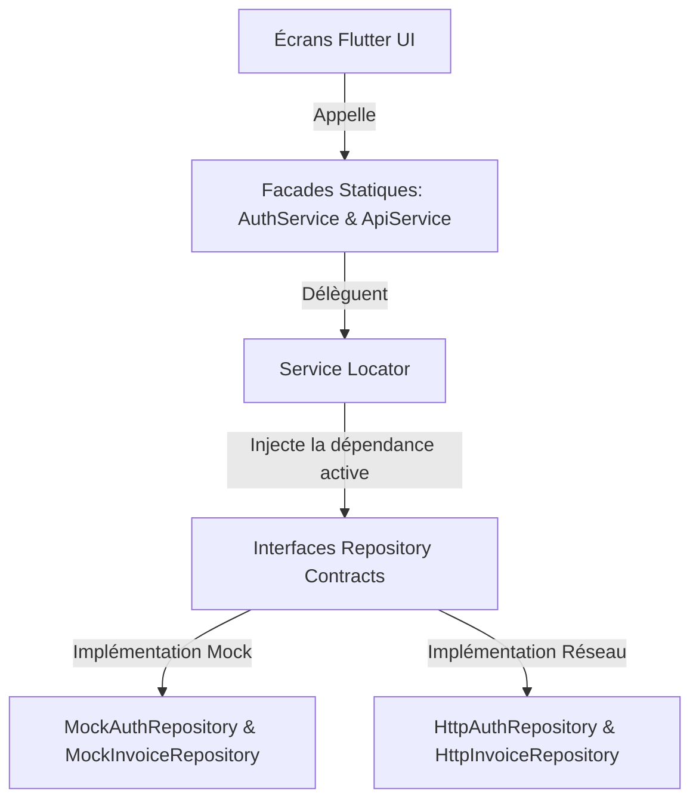

# Rapport d'Architecture Technique - Prototype Mobile CEO-IT 📱
**Développé par Yassine Atrous – Stage d'Été**

Ce document présente l'architecture technique du client mobile **CEO-IT** (Secure Invoice AI), conçu et implémenté sous forme de **prototype autonome hors-ligne** (Mock Sandbox) sous Flutter et Dart.

Il sert de rapport technique pour présenter la structure du code, les choix d'ingénierie et le fonctionnement de l'application à vos pairs et encadrants de stage.

---

## 🏗️ 1. Clean Architecture & Inversion de Dépendance

Pour garantir la flexibilité de l'application et sa transition future vers un environnement de production connecté, le projet implémente les principes de la **Clean Architecture** :

### Les Composants de l'Architecture :
1.  **Repository Contracts (Interfaces)** :
    *   [AuthRepository](file:///c:/plateforme/mobile/lib/repositories/auth_repository.dart) : Définit les méthodes d'authentification et de gestion de session.
    *   [InvoiceRepository](file:///c:/plateforme/mobile/lib/repositories/invoice_repository.dart) : Définit les opérations CRUD et de traitement OCR sur les factures.
2.  **Implémentation Mock (Hors-ligne)** :
    *   [MockAuthRepository](file:///c:/plateforme/mobile/lib/repositories/mock_auth_repository.dart) : Simule l'authentification locale pour trois rôles : administrateur (`admin@demo.com`), comptable (`comptable@demo.com`) et client (`client@demo.com`).
    *   [MockInvoiceRepository](file:///c:/plateforme/mobile/lib/repositories/mock_invoice_repository.dart) : Gère une base de données en mémoire pré-remplie avec des factures réelles et simule le délai d'analyse OCR de 2 secondes.
3.  **Implémentation Réseau (HTTP)** :
    *   [HttpAuthRepository](file:///c:/plateforme/mobile/lib/repositories/http_auth_repository.dart) et [HttpInvoiceRepository](file:///c:/plateforme/mobile/lib/repositories/http_invoice_repository.dart) : Contiennent le code de requêtes HTTP REST prêt pour la production.
4.  **Service Locator (D.I.)** :
    *   [service_locator.dart](file:///c:/plateforme/mobile/lib/core/service_locator.dart) : Centralise l'injection de dépendances. Pour connecter l'application à un vrai serveur de production, il suffit de changer l'enregistrement des repositories de `Mock` à `Http` (seulement deux lignes de code à modifier).
5.  **Façades Statiques de Rétrocompatibilité** :
    *   [AuthService](file:///c:/plateforme/mobile/lib/services/auth_service.dart) et [ApiService](file:///c:/plateforme/mobile/lib/services/api_service.dart) redirigent toutes les anciennes requêtes statiques de l'interface graphique vers l'instance de dépôt injectée active dans le locator.

---

## 🌟 2. Moteur de Simulation IA & Analyse en Mémoire

L'application simule localement les comportements attendus du serveur de manière dynamique :
*   **Traitement Asynchrone OCR** : Lorsqu'un utilisateur télécharge une facture, un minuteur de 2 secondes simule le temps de traitement de l'IA (Gemini API) avant de pré-remplir le formulaire d'édition avec des valeurs dynamiques et des boîtes de délimitation (bounding boxes).
*   **Moteur de Règles de Conformité** : Valide en local si le montant `HT + TVA = TTC`. Par exemple, la facture *Best Trade* affiche une alerte rouge en raison d'une incohérence de calcul de TVA.
*   **Moteur de Détection de Fraude** : Compare l'IBAN de la facture avec les IBAN de référence de la base locale pour identifier les fraudes de substitution (comme le détournement d'IBAN simulé sur la facture *Alpha Industrie*).

---

## 🎨 3. Design Visuel Premium & Animation Personnalisée

L'application adopte une esthétique soignée et professionnelle :
*   **Palette de Couleurs** : Thème chaleureux crème (`#FCF9F6` en arrière-plan) contrasté avec un vert forêt profond (`#012D1D` pour les surfaces primaires) et des touches de vert lime éclatant pour les badges d'action.
*   **Typography** : DM Sans pour le corps du texte et Fraunces pour les titres de sections et d'en-têtes.
*   **Mascotte 3D Three.js Interactive** :
    Intégration d'un robot 3D vectoriel dynamique dans l'écran d'accueil (`mascot.html`) via le moteur local **Three.js** :
    *   La mascotte s'anime avec des comportements réguliers (flottaison, clignement d'yeux, battements d'ailes/propulsion).
    *   Moteur de détection de souris : la tête du robot pivote et regarde le curseur de l'utilisateur en temps réel.
    *   Animation de bienvenue : le robot fait coucou et sourit à l'utilisateur de manière périodique (toutes les 7 secondes).
    *   Intégration Flutter : Intégré sous forme d'iframe sécurisée avec `HtmlElementView` et enregistré de façon moderne avec `dart:ui_web` pour garantir la compatibilité web.
*   **Animation Custom `FileFetchingLoader`** : 
    Création d'un widget personnalisé ([file_fetching_loader.dart](file:///c:/plateforme/mobile/lib/widgets/file_fetching_loader.dart)) traduisant une animation CSS de translation de fichiers :
    *   Affiche 6 cartes de fichiers en dégradé violet qui glissent de gauche à droite sur l'écran avec une transition de fondu et d'échelle (`scale`).
    *   Les retards d'animation (`animation-delay`) sont gérés par un calcul de décalage de phase dynamique sur un unique contrôleur d'animation Flutter.

---

## 🚀 4. Nouvelles Interactions Majeures (Heavenly Interactions)

Pour offrir une sensation tactile de premier ordre (sensations "célestes"), plusieurs surcouches d'interaction ont été implémentées :
*   **Physique de Défilement Élastique (`MajesticScrollBehavior`)** :
    Configuration globale des listes via le `scrollBehavior` de MaterialApp. Les défilements imitent le rebond naturel (Bouncing Physics) et le glissement inertiel pour un effet organique haut de gamme. Activation du support de défilement par clic-glissé de la souris (mouse drag scrolling) pour le simulateur Web.
*   **Micro-interactions de Pression & Survol (`HeavenlyInteraction`)** :
    Création d'un widget générique ([heavenly_interaction.dart](file:///c:/plateforme/mobile/lib/widgets/heavenly_interaction.dart)) encapsulant les boutons et les cartes tactiles. 
    *   Lors du clic/toucher : réduction d'échelle amortie (Spring Scale Down) avec courbes bezier rapides.
    *   Lors du survol (Hover) : zoom progressif léger et changement automatique de curseur de souris.
*   **Transitions Horizontales Fluides (`PageView`)** :
    Remplacement de l'empilement statique de la barre de navigation du tableau de bord par un `PageView` animé via un `PageController` avec une courbe de transition Expo amortie (`Cubic(0.16, 1, 0.3, 1)`), rendant chaque changement d'onglet majestueux.

---

## 💬 5. Questions-Réponses Techniques (Review de Stage)

Voici comment justifier vos choix techniques devant vos collègues ou maîtres de stage :

*   **Pourquoi avoir choisi une approche "Standalone Offline Sandbox" pour cette phase de stage ?**
    > *"Cette approche permet de valider à 100% l'expérience utilisateur (UX) et le comportement logique de l'application de façon fluide, sans dépendance réseau ou indisponibilité serveur lors des démonstrations. La Clean Architecture garantit que l'intégralité de l'interface est découplée de l'origine des données ; le passage vers une vraie base distante ne nécessite aucune modification graphique."*

*   **Comment fonctionne l'injection de dépendance dans l'application ?**
    > *"Nous utilisons un Service Locator (`service_locator.dart`) qui agit comme un conteneur d'instances. Au démarrage, il instancie les dépôts mockés. Les classes de service statiques interrogent ce conteneur pour déléguer les appels de l'interface graphique. Cela évite les dépendances d'importation directes et permet de changer de source de données de manière transparente."*

*   **Pourquoi l'utilisation de `dart:ui_web` et d'une iframe locale pour la mascotte 3D ?**
    > *"Flutter Web permet l'insertion d'éléments HTML natifs via les Platform Views. Intégrer un script Three.js dans une page isolée permet de tirer profit de l'accélération matérielle GPU du navigateur pour le rendu 3D sans interférer avec le thread principal de rendu de Flutter, garantissant ainsi des performances fluides à 60 FPS sans lag."*

*   **Comment l'animation `FileFetchingLoader` est-elle optimisée ?**
    > *"L'animation utilise un unique `AnimationController` pour cadencer la progression globale. Pour chaque carte de fichier, nous appliquons un décalage de phase mathématique (`delayPercent = index * 0.2`) pour déduire l'échelle, l'opacité et la position horizontale en cours. Cela permet d'obtenir un rendu ultra-fluide à 60 FPS sans surcharger le moteur graphique avec de multiples contrôleurs."*

